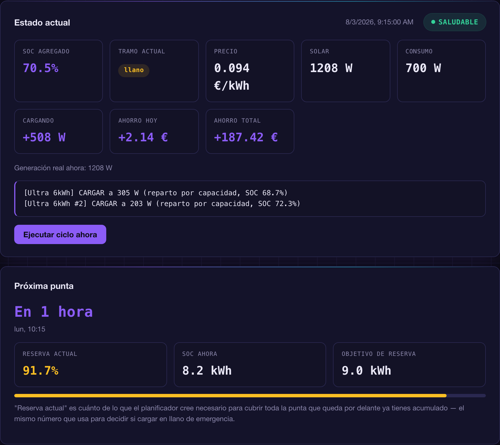
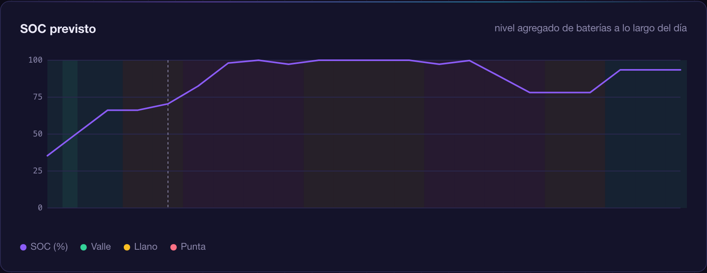
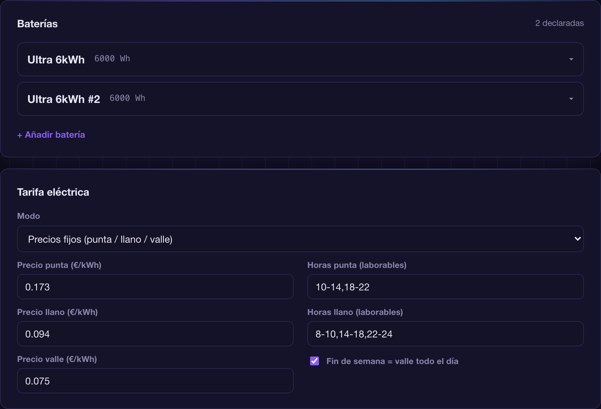
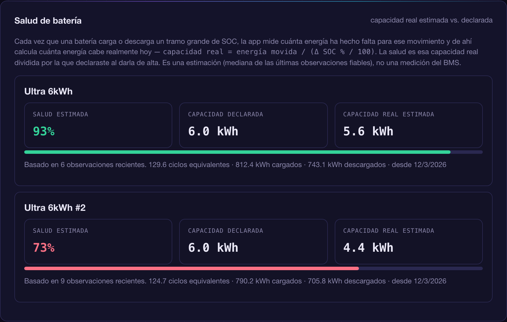
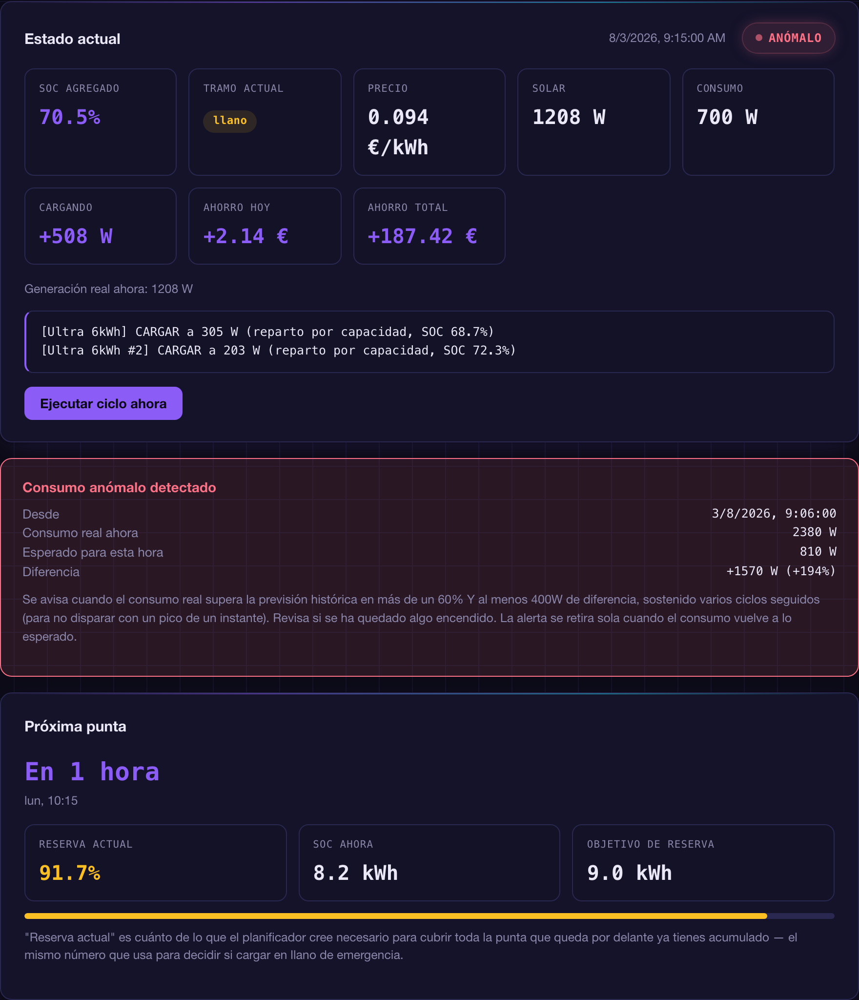

  

<h1 align="center">Battery Orchestrator — documentación</h1>

  🇪🇸 Español · <a href="DOCS.en.md">🇬🇧 Read in English</a>

  <a href="#qué-hace">Qué hace</a> ·
  <a href="#primeros-pasos">Primeros pasos</a> ·
  <a href="#tipo-de-instalación-por-panelstring">Tipo de instalación</a> ·
  <a href="#las-pestañas">Las pestañas</a> ·
  <a href="#salud-de-batería-cómo-se-calcula">Salud de batería</a> ·
  <a href="#ahorro-y-alertas-de-consumo">Ahorro y alertas</a> ·
  <a href="#prioridad-ahorro-autoconsumo-o-longevidad">Prioridad</a> ·
  <a href="#notas-de-seguridad">Notas de seguridad</a>

---

*Las capturas de esta página son de una demo con datos de ejemplo, no de una instalación real.*

## Qué hace

Cada ciclo (configurable, por defecto cada 60s):

1. Calcula el precio de la luz de las próximas horas — tarifa fija
   (
   
   )
   o PVPC dinámico vía sensor de HA, donde los tramos se calculan solos por terciles de precio del día.
2. Suma la previsión solar de todos los paneles/arrays que declares, corrigiendo la hora actual con la generación real medida si tienes un sensor configurado.
3. Calcula el consumo previsto de la casa a partir del histórico real (media por hora del día de los últimos N días).
4. Decide si conviene cargar o descargar, con esta prioridad (ajustable, ver [Prioridad](#prioridad-ahorro-autoconsumo-o-longevidad)):
   - Cargar siempre que haya excedente solar.
   - Cargar en valle lo justo para cubrir la punta más próxima (se salta en modo "Autoconsumo solar").
   - Si con eso no basta (la previsión de punta futura supera lo que cabría cargar en valle), cargar también en llano — "carga de emergencia" — en vez de arriesgarse a quedarse corto (también se salta en "Autoconsumo solar").
   - Descargar en punta primero; en llano solo con el excedente que sobre una vez reservado lo necesario para toda la punta futura del día.
   - Descargar también en valle, pero solo con el excedente que sobre por encima de esa misma reserva — típico tras un día de mucho sol con buena previsión para el siguiente: en vez de comprar de red por la noche (aunque sea barato) o dejar la batería llena sin más, se gasta lo que sobra y se libera hueco para no desperdiciar el sol de mañana. Nunca toca la reserva.
5. Reparte la potencia de carga entre tus baterías proporcional a su capacidad real declarada (una batería llena recibe 0W, el resto se reparte lo que sobra). La descarga NO se reparte — cada batería se autogestiona — pero sí se fija el límite de potencia de descarga de cada una: el máximo que declaraste, salvo que esté llena y siga habiendo excedente solar, en cuyo caso se pone a 0W para que no se autodescargue sin necesidad.
6. Aplica la decisión a Home Assistant (o solo la registra, en modo simulación) y actualiza el histórico del día y las observaciones de salud de cada batería.

Nada de esto usa programación lineal ni aprendizaje automático: es código
que puedes leer de arriba a abajo, y cada hora del plan lleva su motivo en
texto plano.

## Primeros pasos

1. Instala el add-on y ábrelo (aparece en el panel lateral gracias a Ingress).
2. **Empieza en modo simulación** (activado por defecto en "General" → pestaña "Configuración"): en la pestaña "Estado actual" verás exactamente lo que HARÍA, sin tocar nada real.
3. En "Configuración → Baterías", da de alta cada una: nombre, capacidad real en Wh, el sensor de su SOC (%), el switch de carga y el de descarga, la potencia máxima de carga/descarga y el SOC mínimo/máximo que quieras respetar. Si tu batería expone entidades `number` para limitar la potencia de carga/descarga, decláralas también (opcional pero recomendado — si no las declaras, la app solo enciende/apaga el switch sin poder repartir potencia con precisión). El "sensor de descarga" (opcional) es un sensor de potencia que solo salga positivo cuando la batería está aportando energía a la casa (p. ej. `..._load_from_battery`); se usa para el cálculo de consumo real y para estimar la salud.
4. Configura la tarifa en "Configuración → Tarifa eléctrica": fija (introduce tus precios punta/llano/valle y horarios) o PVPC (indica tu sensor de HA — los tramos se calculan solos por terciles de precio del día).
5. Añade tus paneles solares en "Configuración → Previsión solar": por sensor de HA que ya publique previsión, o directamente por la API de Forecast.Solar (necesitas lat/lon/inclinación/azimut/kWp de tu instalación; la API key es opcional, vacío = plan gratuito). Si tienes un sensor de generación instantánea de ESE panel/string, decláralo en el mismo formulario — corrige la hora actual de ese panel con el dato real en vez de depender solo de la previsión. Si tienes varios strings/tejados, cada uno con su propio sensor, no hace falta crear ningún sensor agregado en Home Assistant: declara cada uno por separado y la app los suma sola, tanto la previsión como la generación real. Indica también el **tipo de instalación** de cada panel (ver más abajo).
6. Consumo real de la casa, en "Configuración → Consumo de la casa": indica un sensor que **ya reste la carga AC de las baterías** (por ejemplo un "consumo instantáneo" de tu instalación) — **no** un medidor de red en bruto que sí la incluya. La app le suma sola, hora a hora, la producción solar y la descarga de cada batería (los sensores del paso 3) para reconstruir el consumo real completo, sea cual sea la fuente que lo esté cubriendo en cada momento. No hace falta ningún sensor con signo ni de carga: los términos de carga se cancelan matemáticamente al partir de un sensor que ya los resta.
7. Si tienes potencia contratada, indícala en "Configuración → Seguridad y límites" para que nunca la supere al cargar desde red (la carga con excedente solar no cuenta, no tira de la red).
8. Pulsa "Ejecutar ciclo ahora" en "Estado actual" y revisa el plan del día y la gráfica de SOC en la pestaña "Previsión".
9. Elige tu modo de prioridad en "Configuración → Prioridad" si el comportamiento por defecto ("Ahorro") no es el que quieres — ver [Prioridad](#prioridad-ahorro-autoconsumo-o-longevidad).
10. Cuando confíes en las decisiones, desactiva el modo simulación.
11. Descarga una copia de tu configuración desde "Configuración → Copia de seguridad" — útil si algún día reinstalas el add-on.

## Tipo de instalación por panel/string

El tipo de instalación se declara en cada **panel/array solar**, no en la batería — porque una misma instalación puede tener paneles de los dos tipos a la vez (p. ej. un string conectado directo a una batería y otro alimentando una instalación de autoconsumo aparte). Cada panel es uno de dos tipos:

- **Instalación de autoconsumo (AC)** — este panel/string NO está conectado directamente a ninguna batería. Para que una batería aproveche su excedente, la app tiene que activar explícitamente el modo carga y fijar la potencia por AC — es el comportamiento de siempre.
- **Conectado directo a batería (inversor integrado)** — este panel/string va cableado directamente a una batería con inversor híbrido/integrado. En este caso NO hace falta que la app active ningún modo de carga: la batería ya absorbe ese excedente ella sola, al regular su propia salida se queda con lo que sobra. La app descuenta automáticamente esa potencia de lo que manda pedir por AC al resto de baterías (para no duplicar), y solo registra una estimación para el histórico y la salud — no manda ninguna orden real por esa parte. Para cargar desde red (valle o emergencia en llano) y para descargar, la app sigue mandando la orden explícita en cualquier caso, sea cual sea el tipo del panel.

Si te equivocas de tipo no pasa nada grave: marcar un panel de autoconsumo como "conectado a batería" hace que la app descuente de más al pedir carga por AC (las baterías cargarán algo menos rápido de lo que podrían); marcar un panel realmente conectado a batería como "autoconsumo" hace que la app pida más potencia por AC de la que hace falta (inofensivo, la batería ya estaba recibiendo esa energía por su cuenta). Revisa el log de "Estado actual" tras el cambio para confirmar que hace lo que esperas.

## Las pestañas

  

- **Estado actual** — resumen del ciclo más reciente: SOC agregado (con la tendencia de las últimas horas), tramo tarifario, precio, solar, consumo, si se está cargando/descargando, ahorro acumulado hoy y en total, cuenta atrás al próximo cambio de tramo y comparativa del consumo de hoy frente a la media de los últimos días. Un indicador junto al título marca "Saludable" o "Anómalo" según si se ha detectado un consumo fuera de lo normal (ver [Ahorro y alertas](#ahorro-y-alertas-de-consumo)). Debajo, el log de lo que hizo la última ejecución. Más abajo: un diagrama del flujo de energía ahora mismo (de dónde sale la potencia solar y a dónde va), un medidor de cuánto estás usando de tu potencia contratada, el desglose de cada batería individual, y la cuenta atrás a la próxima hora punta con cuánta reserva llevas acumulada para cubrirla.

  

- **Previsión** — gráfica del SOC agregado de todas tus baterías a lo largo del día (con las franjas de tarifa de fondo y una línea marcando "ahora"), y la tabla "Plan del día" completa: de 00:00 a 00:00, combinando lo que ya pasó hoy (histórico real) con lo previsto desde ahora.
- **Salud de batería** — ver más abajo.

  

- **Configuración** — todo lo que declaras tú: baterías, tarifa, solar, consumo, límites, prioridad, ajustes generales y copia de seguridad.

## Salud de batería: cómo se calcula

  

Dos métricas distintas, con orígenes distintos:

- **Salud estimada (capacidad real vs. declarada)** — la que se muestra en grande en cada tarjeta. Cada vez que una batería completa un tramo de carga o descarga de al menos un 8% de SOC de un tirón, la app mide cuánta energía ha hecho falta para ese movimiento: `capacidad real = energía movida / (Δ SOC % / 100)`. Se guarda la mediana de las últimas observaciones fiables, y la salud es esa capacidad real dividida por la que declaraste al dar de alta la batería. Hace falta al menos una observación así de grande para que aparezca — si tu batería solo hace movimientos pequeños, verás un aviso en vez de un número inventado.
- **Ciclos equivalentes** — cuenta de por vida (nunca caduca) de toda la energía cargada + descargada, dividida entre el doble de la capacidad declarada. Es una medida de cuánto trabajo ha hecho la batería, no de cuánta capacidad le queda; se muestra como dato de contexto junto a la salud.

Ninguna de las dos es una medición del BMS — no hay forma de saber el
estado real de las celdas sin uno. Son estimaciones honestas: se explica
de dónde sale cada número y con qué margen de confianza (el número de
observaciones), nada de caja negra.

## Ahorro y alertas de consumo

  

**Ahorro acumulado.** Cada ciclo se calcula lo que se ha pagado de verdad (lo que se compra a red para consumo directo, más lo que se cargue de red en la batería) y se compara contra lo que se habría pagado sin batería (comprar directamente a red lo que el solar no cubra, cada hora a su precio real). La diferencia es el ahorro; se acumula por día y en total desde que la app lleva la cuenta. En horas de carga desde red puede salir momentáneamente negativo — es normal, esa energía se recupera después al evitar comprar en punta.

**Alerta de consumo anómalo.** Cada ciclo se compara el consumo real medido ahora mismo contra lo que la previsión histórica esperaba para esta hora del día. Si el consumo real supera la previsión en más de un 60% **y** la diferencia es de al menos 400W (para no disparar con bases de consumo pequeñas), y eso se sostiene 3 ciclos seguidos, el indicador de "Estado actual" pasa de "Saludable" a "Anómalo", se abre un cuadro debajo con el detalle (desde cuándo, consumo real vs. esperado, diferencia) y se crea una notificación persistente en Home Assistant. Se retira sola (indicador, cuadro y notificación) cuando el consumo vuelve a lo esperado durante 3 ciclos seguidos. Solo funciona si tienes el sensor de consumo configurado en "Configuración → Consumo de la casa".

## Prioridad: ahorro, autoconsumo o longevidad

En "Configuración → Prioridad" eliges cómo decide el planificador entre tres modos, cada uno una regla clara, no un peso difuso:

- **Ahorro** (por defecto) — el comportamiento de siempre: carga con excedente solar, y también desde red en valle (o en llano de emergencia si hace falta) lo justo para cubrir la próxima punta.
- **Autoconsumo solar** — la batería SOLO carga con excedente solar, nunca desde red aunque esté barata. Menos ahorro potencial en días con poco sol, pero cero ciclos de carga "artificiales" pagados.
- **Longevidad de batería** — igual que "Ahorro", pero el objetivo de carga nunca supera el 90% del SOC máximo real configurado, para reducir el desgaste de mantener la batería siempre llena.

Además, con "Ahorro" o "Longevidad" seleccionado (no aplica con "Autoconsumo solar", que nunca carga desde red), hay un interruptor aparte:

- **Carga sostenida** — en vez de cargar siempre a máxima potencia, la carga deliberada desde red (valle y la de emergencia en llano) se reparte a una potencia sostenida a lo largo de las horas que quedan hasta la primera vez que la batería vaya a hacer falta de verdad (la próxima hora, sea llano o punta, con consumo previsto por encima del solar — en valle nunca se descarga, así que no cuenta), con un margen de seguridad del 20% por si la previsión falla un poco. Cargar despacio y sostenido genera menos calor y estrés que ráfagas a máxima potencia. Si el tiempo se echa encima (por ejemplo, entra en la carga de emergencia en llano con la punta ya cerca), el mismo cálculo da una potencia alta por sí solo — no hay una rama de "pánico" aparte, es el mismo número con menos horas para repartir. La carga con excedente solar no se ve afectada: es oportunista y gratis, no tiene sentido ir más despacio y desperdiciar sol.

## Notas de seguridad

- Una batería con el sensor de SOC caído se omite ese ciclo entero (no se inventa un valor), y aparece listada como omitida en "Estado actual".
- Si una batería llega a su SOC máximo configurado y sigue habiendo excedente solar, su límite de descarga se pone a 0W para que no se autodescargue sin necesidad.
- El objetivo de carga respeta el SOC máximo real que hayas configurado por batería (si pones un tope por debajo del 100% para alargar su vida útil, la reserva de energía para la punta lo tiene en cuenta y no intenta superarlo).
- La potencia contratada solo limita la carga desde red (la carga con excedente solar no cuenta, no tira de la red).
- La previsión de consumo/solar por histórico reintenta sola con ventanas más cortas si tu Home Assistant conserva menos días de los que pides (por defecto el `recorder` solo guarda 10).
- El ahorro acumulado y la alerta de consumo anómalo necesitan el sensor de "Consumo de la casa" configurado — sin él, ni se calculan ni aparecen en "Estado actual".
- Restaurar una configuración desde archivo solo comprueba que tenga las claves básicas esperadas (baterías, tarifa, solar, general); revisa los datos después de importar por si vienen de una versión antigua del add-on.
